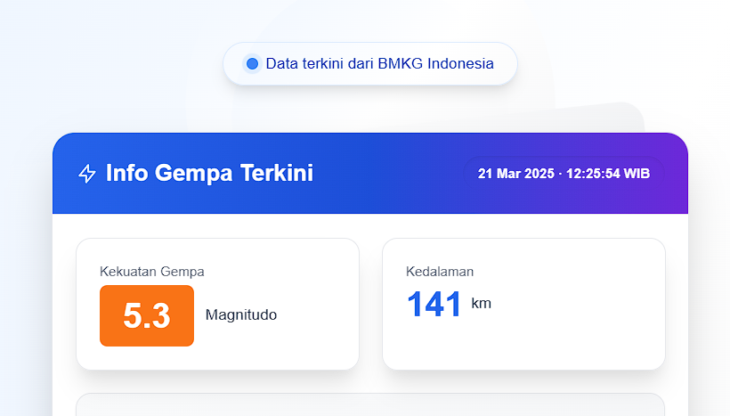

# BMKG Earthquake Information

A Web Application for Latest Earthquake Information

## Preview



## Description

This project is a web application that provides the latest information about earthquakes in Indonesia. The earthquake data is fetched from BMKG (Badan Meteorologi, Klimatologi, dan Geofisika) Indonesia and is automatically updated every minute.

## Features

- Displays the latest earthquake information including magnitude, depth, location, and potential.
- Earthquake map that can be viewed on Google Maps.
- Notifications when new earthquake data is found.
- Responsive design with engaging animations.

## Technologies Used

- React
- Vite
- Tailwind CSS
- Axios
- Framer Motion
- React Toastify

## Installation

1. Clone this repository:

   ```bash
   git clone https://github.com/aldotobing/earthquake-info-project.git
   cd earthquake-info-project
   ```

2. Install dependencies:

   ```bash
   npm install
   ```

3. Run the application:

   ```bash
   npm run dev
   ```

4. Open your browser and access `http://localhost:3000`.

## Project Structure

```
.
├── index.html
├── package.json
├── postcss.config.js
├── tailwind.config.js
├── vite.config.js
├── src
│   ├── App.jsx
│   ├── index.css
│   ├── main.jsx
│   ├── components
│   │   ├── GempaBumiInfo.jsx
│   │   └── ui
│   │       ├── button.jsx
│   │       └── card.jsx
└── README.md
```

## Contribution

Contributions are welcome! If you have suggestions or find bugs, please create an issue or pull request.

## License

This project is licensed under the MIT License. See the [LICENSE](LICENSE) file for more information.
